
 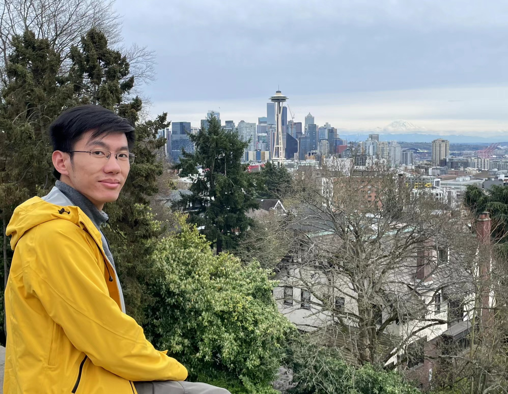 

## Biography

I am currently a Senior Research Scientist at Alibaba, focusing on large language models, multimodal models, and their applications in search ads, under the leadership of [Jian Xu](https://scholar.google.com/citations?user=30VZBsIAAAAJ&hl=en). Previously, I was a researcher at SenseTime, where I worked on computer vision and neural architecture search with [Ming Sun](https://msunming.github.io/), Prof. [Wanli Ouyang](https://wlouyang.github.io/), and Dr. [Junjie Yan](https://scholar.google.com/citations?user=rEYarG0AAAAJ&hl=en). Prior to that, I researched object detection and segmentation at Baidu's Institute of Deep Learning (IDL) under [Shilei Wen](https://scholar.google.com/citations?user=zKtYrHYAAAAJ&hl=zh-CN).

I earned my master’s degree from the School of Computer Science at Beijing Institute of Technology, supervised by Prof. [Yuwei Wu](https://wu-yuwei-bit.github.io/) and Prof. [Yunde Jia](https://scholar.google.com/citations?user=Sl6TV7gAAAAJ&hl=zh-CN).

If you are interested in working with me as a research intern, please feel free to drop me an email through xingyuanbu at gmail dot com.

## General information

-  
<strong>Links:</strong>  <a href="https://scholar.google.com/citations?user=cqYaRhUAAAAJ&hl=en">Google Scholar</a>  <a href="https://github.com/xingyuanbu">GitHub</a>   <a href="https://www.linkedin.com/in/xingyuanbu/">LinkedIn</a>  

- <strong>Email:</strong> xingyuanbu at gmail dot com
- <strong>Research interests:</strong> Computer Vision, Multimodality, Large Language Models.
- <strong>Professional Services:</strong> I am a reviewer for several top-tier conferences and journals, ICLR, NeurIPS, CVPR, ACL, EMNLP, NAACL, MM, TPAMI, TCSVT, TMM, CVIU, PR.

## Selected Publications
<strong>*</strong>Equal contribution, <strong>#</strong>Corresponding author

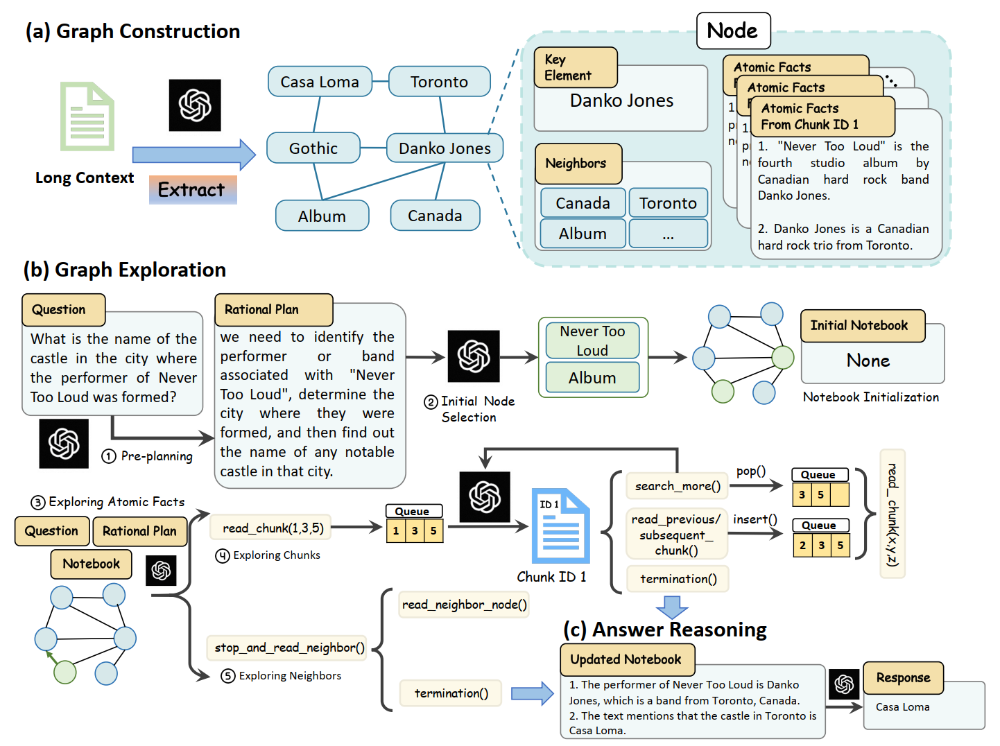

- GraphReader: Building Graph-based Agent to Enhance Long-Context Abilities of Large Language Models.
  Shilong Li, Yancheng He, Hangyu Guo, <strong>Xingyuan Bu*#</strong>, Ge Bai et al.
  <strong>EMNLP 2024.</strong>
  [[paper]](https://arxiv.org/abs/2406.14550)

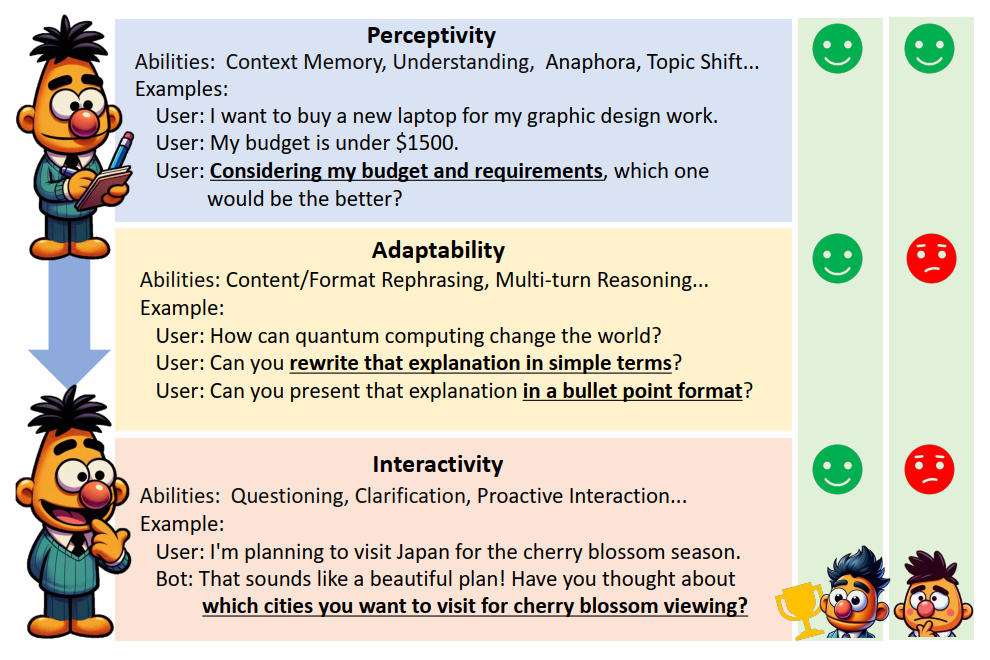

- MT-Bench-101: A Fine-Grained Benchmark for Evaluating Large Language Models in Multi-Turn Dialogues.
  Ge Bai, Jie Liu, <strong>Xingyuan Bu*#</strong>, Yancheng He, Jiaheng Liu et al.
  <strong>ACL 2024.</strong>
  [[paper]](https://arxiv.org/abs/2402.14762) [[code]](https://github.com/mtbench101/mt-bench-101)

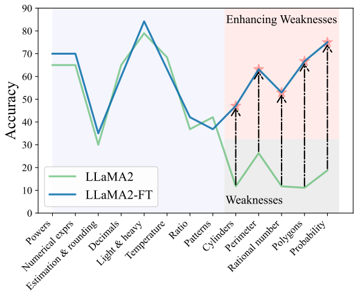

- ConceptMath: A Bilingual Concept-wise Benchmark for Measuring Mathematical Reasoning of Large Language Models.
  Yanan Wu, Jie Liu, <strong>Xingyuan Bu*</strong>, Jiaheng Liu et al.
  <strong>ACL 2024.</strong>
  [[paper]](https://arxiv.org/abs/2402.14660) [[code]](https://github.com/conceptmath/conceptmath)

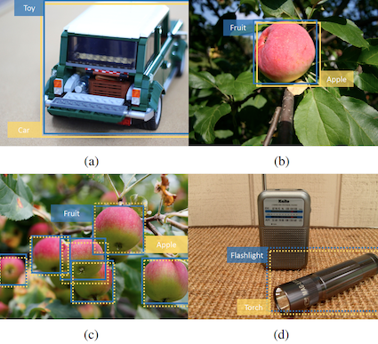

- Large-Scale Object Detection in the Wild With Imbalanced Data Distribution, and Multi-Labels.
  Cong Pan, Junran Peng, <strong>Xingyuan Bu</strong>, and Zhaoxiang Zhang.
  <strong>TPAMI 2024.</strong>
  [[paper]](https://ieeexplore.ieee.org/abstract/document/10579784)

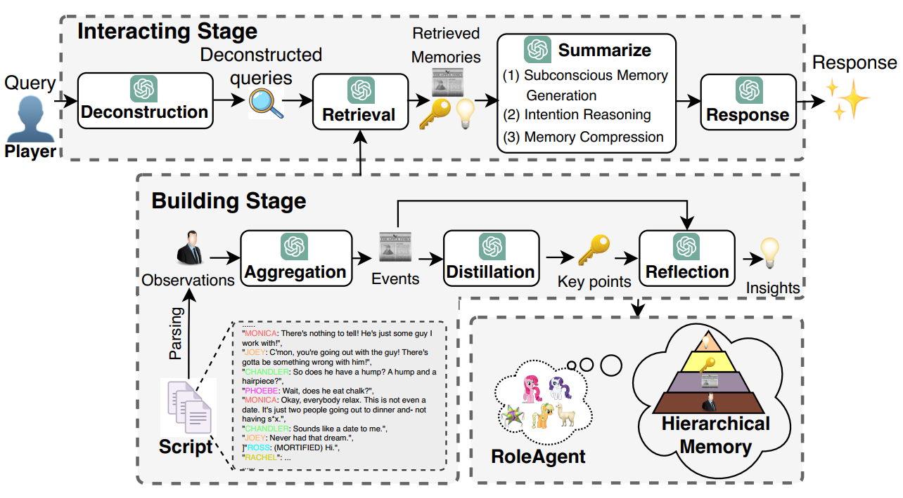

- RoleAgent: Building, Interacting, and Benchmarking High-quality Role-Playing Agents from Scripts.
  Jiaheng Liu, Zehao Ni, Haoran Que, ..., <strong>Xingyuan Bu</strong> et al.
  <strong>NeurIPS 2024.</strong>
  [[paper]]()

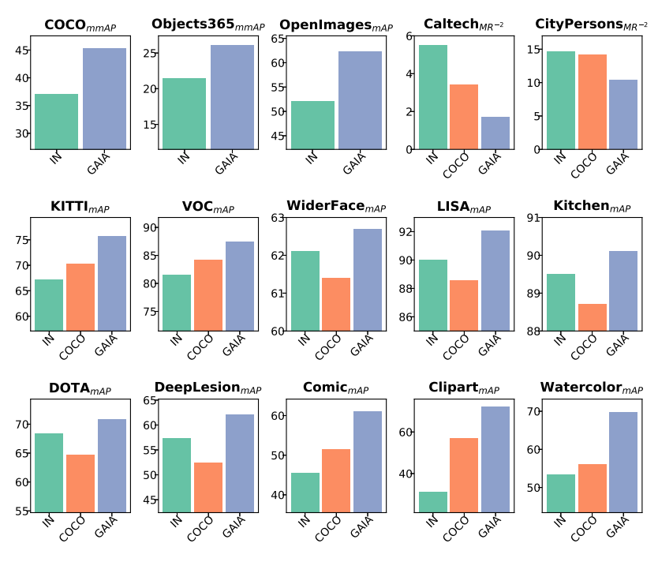

- GAIA-Universe: Everything is Super-Netify.
  Junran Peng, Qing Chang, Haoran Yin, <strong>Xingyuan Bu</strong>, Jiajun Sun, Lingxi Xie, Xiaopeng Zhang, Qi Tian, and Zhaoxiang Zhang.
  <strong>TPAMI 2023.</strong>
  [[paper]](https://ieeexplore.ieee.org/document/10125046) [[code]](https://github.com/GAIA-vision/GAIA-det)

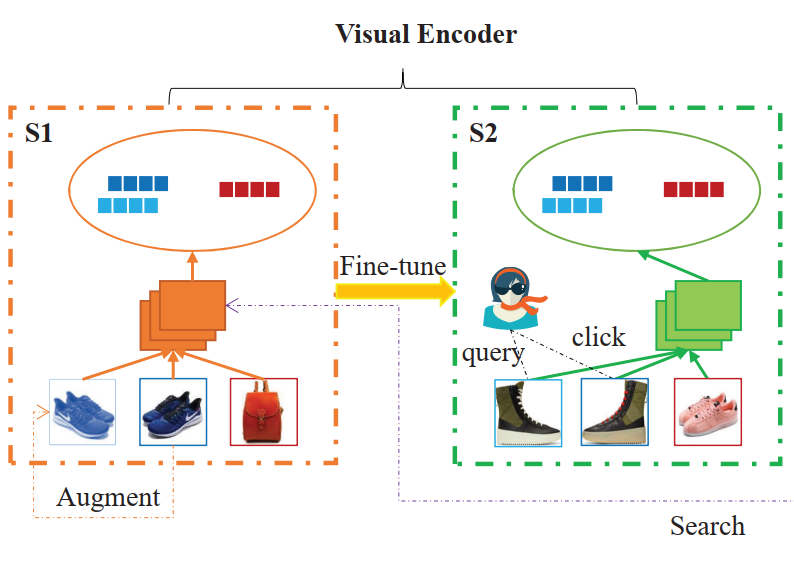

- Visual Encoding and Debiasing for CTR Prediction.
  Guipeng Xv, Si Chen, Chen Lin, Wanxian Guan, <strong>Xingyuan Bu</strong>, Xubin Li, Hongbo Deng, Jian Xu et al.
  <strong>CIKM 2022.</strong>
  [[paper]](https://arxiv.org/abs/2205.04168)

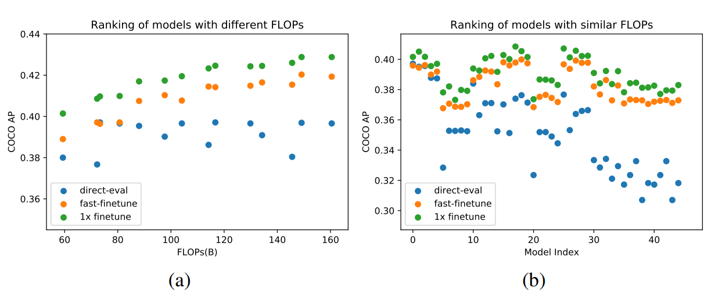

- GAIA: A Transfer Learning System of Object Detection that Fits Your Needs.
  <strong>Xingyuan Bu</strong>, Junran Peng, Junjie Yan, Tieniu Tan, and Zhaoxiang Zhang.
  <strong>CVPR 2021.</strong>
  [[paper]](https://arxiv.org/abs/2106.11346) [[code]](https://github.com/GAIA-vision/GAIA-det)

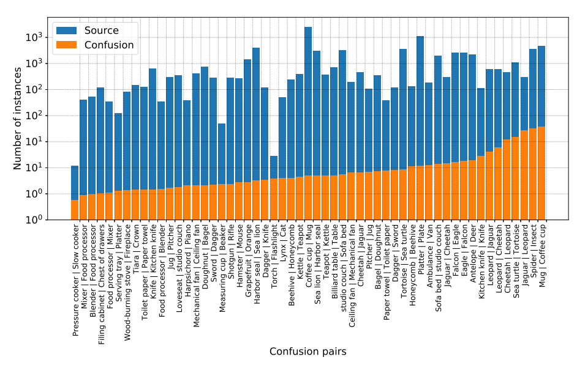

- Large-Scale Object Detection in the Wild from Imbalanced Multi-Labels.
  Junran Peng, <strong>Xingyuan Bu*</strong>, Ming Sun, Zhaoxiang Zhang, Tieniu Tan, and Junjie Yan.
  <strong>CVPR 2020.</strong>
  [[paper]](https://arxiv.org/abs/2005.08455)

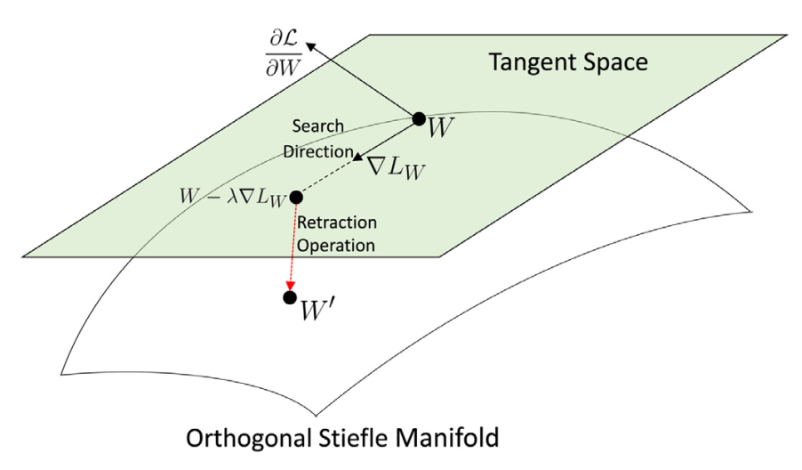

- Learning a Robust Representation via a Deep Network on Symmetric Positive Definite Manifolds.
  Zhi Gao, Yuwei Wu, <strong>Xingyuan Bu</strong>, Tan Yu, Junsong Yuan, and Yunde Jia.
  <strong>Pattern Recognition 2019.</strong>
  [[paper]](https://www.sciencedirect.com/science/article/abs/pii/S0031320319301062)

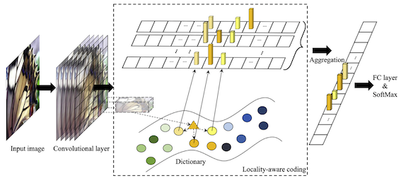

- Deep Convolutional Network with Locality and Sparsity Constraints for Texture Classification.
  <strong>Xingyuan Bu</strong>, Yuwei Wu, Zhi Gao, and Yunde Jia.
  <strong>Pattern Recognition 2019.</strong>
  [[paper]](https://www.sciencedirect.com/science/article/abs/pii/S0031320319300676)

[Back to top](#biography)
